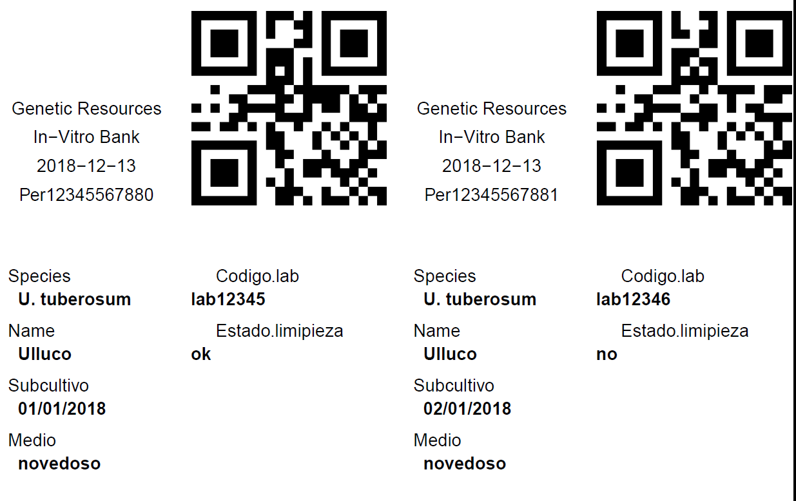

<!-- README.md is generated from README.Rmd. Please edit that file -->

```{r setup, include = FALSE}
knitr::opts_chunk$set(
  collapse = TRUE,
  comment = "#>",
  fig.path = "man/figures/README-",
  out.width = "100%"
)
```
# qr4genebanks
[](https://www.repostatus.org/#active)
[](https://codecov.io/github/rsimon64/qr4genebanks?branch=master)
[](https://www.tidyverse.org/lifecycle/#maturing)

The goal of qr4genebanks is to provide simple tools to print 2-dimensional bar-codes in the popular QR format for plant collection genebanks. The package has currently only one function that expects a table containing the information to be printed with one row per label.

Label designs are available for a few standard label sizes and are created in PDF format. The PDF file can then be sent to the label printer over the intranet. The designs are based on four square blocks that can be arranged in rows and columns. 

## Installation

You can install the released version of qr4genebanks from [CRAN](https://CRAN.R-project.org) with:

``` r
# install.packages("devtools")
devtools::install_github("rsimon64/qr4genebanks")
```

## Example

The following code will create a PDF file. Here we insert a PNG snapshot. 
```{r eval=FALSE}
qr4genebanks::qg_print_labels()
```

## Configuration

The label ayouts can be configured through yaml files. There are four examples for different label types (small square, medium square, large rectangular) reflecting typical use cases in a plant genebank (DNA storage, in-vitro cultures, field collection respectively).

One block is reserved for including a raster image typically used for a logo of the lab or institute.

The QR image itself stores in this version just the main identifier.

More information can be found in the tutorial.
